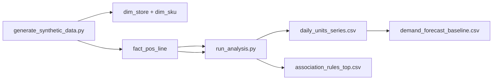

# Retail Demand & Market Basket Lab

**Author:** Faiz Elahi · **Type:** EDUCATIONAL PORTFOLIO LAB · **SYNTHETIC DATA ONLY**

---

## Educational disclaimer / synthetic data

This lab uses **entirely synthetic** POS transactions, stores, and SKUs. Nothing connects to production retailers, loyalty programs, or employer systems. Identifiers are fabricated for classroom use.

Use honest language: *“I practiced demand baselines and association rules on synthetic POS data.”*

---

## Problem statement (detailed)

Retail analytics teams split work across **demand planning** and **assortment insight**:

- **Demand:** How many units (or dollars) should we expect next week per store or category?
- **Market basket:** Which SKUs co-occur in the same transaction strongly enough to inform planograms or promotions?

Without a full forecasting platform, students still need a **credible pipeline**: star-like dimensions (`dim_store`, `dim_sku`), a line-level fact (`fact_pos_line`), daily unit series, a simple **28-day moving average baseline**, and **association rules** (Apriori via `mlxtend` when installed, pandas fallback otherwise).

This lab plants **known basket patterns** (e.g., milk/bread/eggs) so rule mining succeeds in one class period—then you discuss why real POS needs promotion filters and seasonality.

---

## Why this tool

| Spreadsheet pivot | This lab pipeline |
|-------------------|-----------------|
| Hidden grain errors | Explicit fact line grain |
| One-off charts | Reproducible scripts + CSV outputs |
| Black-box vendor rules | Visible support/lift thresholds in code |

Pairs naturally with **`databricks-lakehouse-medallion-lab`** (retail events) and **`prefect-orchestration-lab`** (orchestrated rollups).

---

## Architecture



See [`docs/architecture.md`](docs/architecture.md).

---

## Dataset dictionary (tables / columns)

| Table / file | Grain | Key columns |
|--------------|-------|-------------|
| `dim_store.csv` | Store | `store_id`, `region` |
| `dim_sku.csv` | Product | `sku_id`, `category`, `unit_price` |
| `fact_pos_line.csv` | POS line | `transaction_id`, `txn_date`, `store_id`, `sku_id`, `quantity`, `line_revenue` |
| `daily_units_series.csv` | Day | Aggregated units (output) |
| `demand_forecast_baseline.csv` | Day | Actual vs 28-day MA baseline (output) |
| `association_rules_top.csv` | Rule | Support/lift metrics (output) |

Nine months of 2024 daily transactions are generated with **planted basket patterns** for teaching.

---

## Prerequisites

- Python 3.10+
- `pandas`, `matplotlib` (see `requirements.txt`)
- Optional: `mlxtend` for Apriori (fallback path if missing)

---

## Step-by-step: how to run

### Windows PowerShell

```powershell
cd retail-demand-basket-lab
python -m venv .venv
.\.venv\Scripts\Activate.ps1
pip install -r requirements.txt
python scripts/generate_synthetic_data.py
python src/run_analysis.py
```

### Optional bash

```bash
cd retail-demand-basket-lab
python3 -m venv .venv && source .venv/bin/activate
pip install -r requirements.txt
python scripts/generate_synthetic_data.py
python src/run_analysis.py
```

---

## File-by-file walkthrough

| Path | Role |
|------|------|
| `scripts/generate_synthetic_data.py` | Builds dimensions + ~9 months POS lines with planted baskets |
| `src/run_analysis.py` | Daily series, MA forecast, association rules |
| `data/*.csv` | Inputs and analysis outputs |
| `docs/images/` | `demand_forecast.png`, `revenue_by_category.png`, `basket_association_rules.png` (after analysis/charts step if present) |

---

## Expected outputs and how to interpret them

- **`demand_forecast_baseline.csv`** — Compare actual daily units to rolling mean; baseline is intentionally simple.
- **`association_rules_top.csv`** — High **lift** on planted SKUs; lower support cuts noise.
- **Charts** — Visual check for category revenue mix and rule teaching moments.

Forecast line may look **flat**—use that to introduce seasonality, promotions, and ML alternatives (Prophet, XGBoost, etc.).

---

## Results interpretation

- **Lift > 1** suggests co-purchase stronger than independence **in synthetic data**—not causation for planograms.
- **28-day MA** lags sudden shifts—discuss cold start at series beginning.
- **mlxtend vs fallback** may yield slightly different rule lists—compare in exercise.

---

## Glossary (8+ terms)

1. **Market basket** — Items bought together in one transaction.
2. **Support** — Frequency of an itemset across baskets.
3. **Confidence** — Conditional probability of consequent given antecedent.
4. **Lift** — Rule strength vs statistical independence.
5. **Apriori** — Classic frequent itemset algorithm.
6. **Baseline forecast** — Simple benchmark before advanced models.
7. **POS grain** — One row per line item on a receipt.
8. **Planogram** — Shelf layout; do not change from correlation alone.
9. **Planted pattern** — Generator-inserted association for teaching.

---

## Common mistakes (5+)

1. Forecasting **revenue** without modeling stockouts (not in lab).
2. **Low min_support** exploding false-positive rules.
3. Treating **correlation as causation** for merchandising.
4. Forgetting **promotion filters** when moving to real POS feeds.
5. Ignoring **store/region facets** when national rollups hide local demand.
6. Skipping **train/holdout** discussion for forecast metrics.

---

## Exercises (5+)

1. Forecast **by category** instead of total units.
2. Add **store-region facet** on revenue chart.
3. Tune **`min_support`** and document lift changes in a short table.
4. Implement **weekly seasonality dummy** in baseline (stretch).
5. Export **top 20 rules** to markdown for a mock merchant review.
6. Join outputs to **`prefect-orchestration-lab`** retail CSV theme conceptually.

---

## Limitations / simulation vs production

- Synthetic patterns are **plausible, not representative** of any retailer.
- No inventory, shrink, or multichannel returns.
- No real-time streaming POS—batch CSV only.
- Educational code—**no production SLA**.

---

## Related labs

- [`databricks-lakehouse-medallion-lab`](../databricks-lakehouse-medallion-lab/) — Medallion retail events.
- [`prefect-orchestration-lab`](../prefect-orchestration-lab/) — Retail ingest orchestration.
- [`apache-superset-dashboard-as-code-lab`](../apache-superset-dashboard-as-code-lab/) — Regional KPI dashboards.

---

**Author:** Faiz Elahi · Educational portfolio use.
